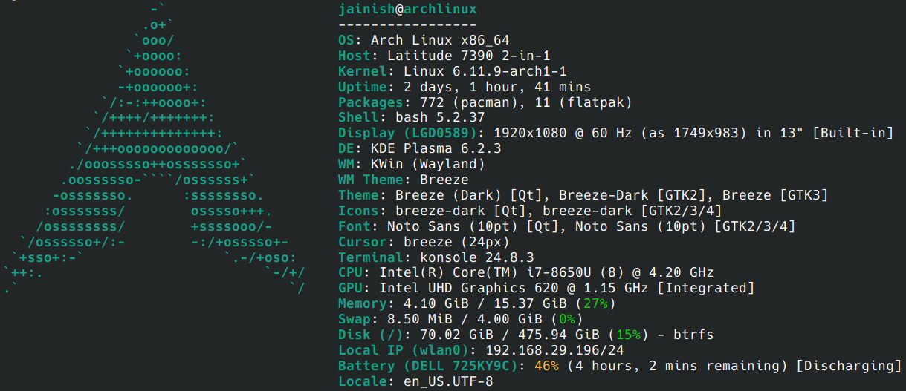

# 👋 Hii, I'm Jainish Prajapati!

## About Me
- 🐧 I use Arch BTW
- 🌐 Living in the matrix made of 0s and 1s

## ⚙️ Tech stack

  

  

  

  

  

## 📊 Stats

  

  

  

## 📈 Contributions

        

## 💬 Let's Connect!

Got a cool project idea? Or just geek out about programming? Hit me up!

- [LinkedIn](https://www.linkedin.com/in/jainish-prajapati)

 

##

    

